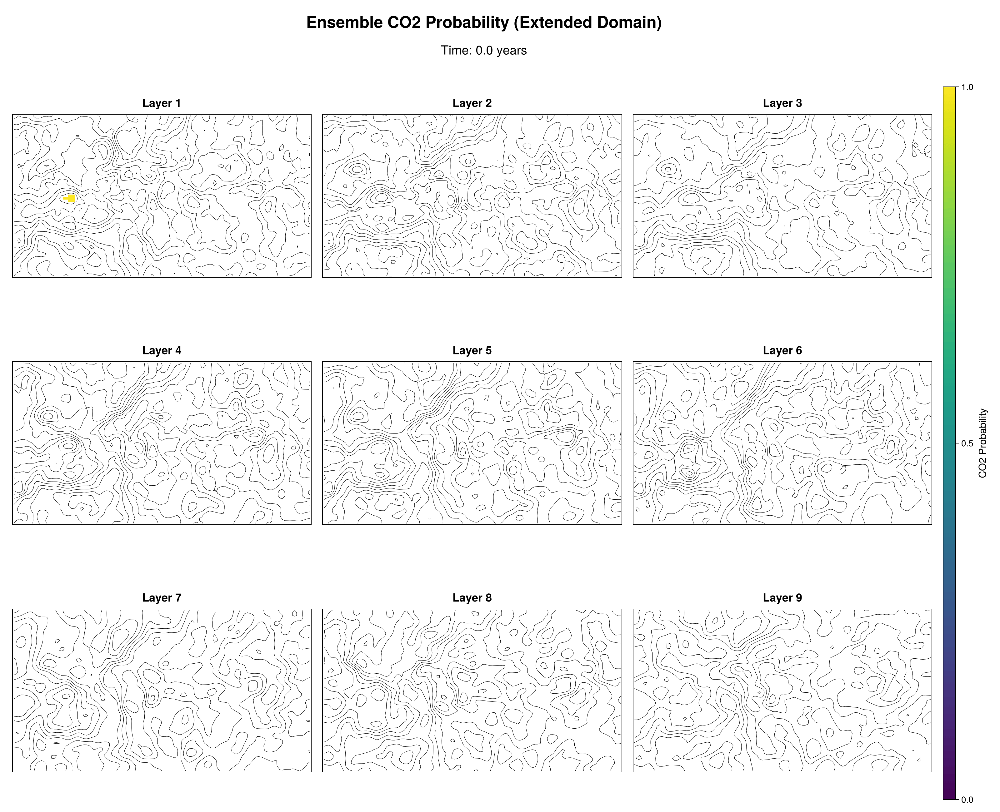

# CO2InjectionModeling



CO2InjectionModeling.jl is a Julia package for modeling CO2 injection and migration in subsurface geological formations. It provides tools to simulate the movement, trapping and potential leakage of injected CO2.

> **⚠️ WARNING: This package is a work in progress!**

## Integration with SurfaceWaterIntegratedModeling
This package leverages the [SurfaceWaterIntegratedModeling.jl](https://github.com/your-org/SurfaceWaterIntegratedModeling.jl) package. Key functions such as trap structure analysis, spill event handling, and time series interpolation are provided by SurfaceWaterIntegratedModeling, and are used to:
- Identify and analyze geological traps
- Track CO2 fill states and spill events over time
- Interpolate time-dependent results

## Getting Started
1. Clone the repository and install dependencies:
	```julia
	using Pkg
	Pkg.activate(".")
	Pkg.instantiate()
	```
2. Run example simulations from the `examples/` folder, e.g.:
	```julia
	include("examples/sleipner_layers.jl")
	```
3. View results and animations in the `media/` folder.


## License
See [LICENSE](LICENSE).
<!-- [](https://ellingsvee.github.io/CO2InjectionModeling.jl/stable/)
[](https://ellingsvee.github.io/CO2InjectionModeling.jl/dev/)
[](https://github.com/ellingsvee/CO2InjectionModeling.jl/actions/workflows/CI.yml?query=branch%3Amain)
[](https://codecov.io/gh/ellingsvee/CO2InjectionModeling.jl) -->
