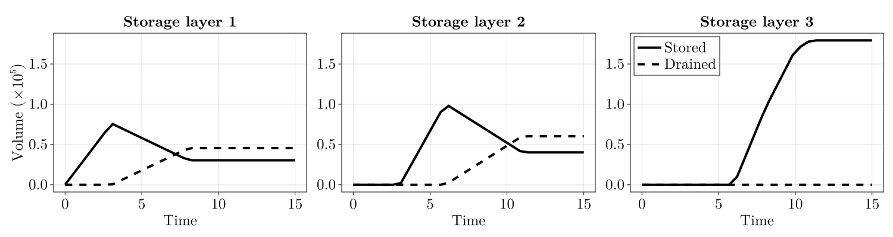
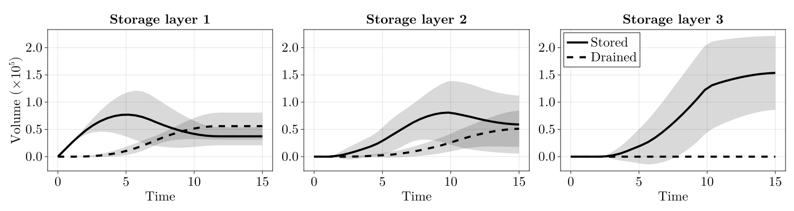

# Summary

When $\text{CO}_2$ is injected into a deep saline aquifer for geological storage, it migrates upward and accumulates beneath low-permeability shale layers in structural traps. If pressure builds sufficiently, $\text{CO}_2$ can breach the shale and enter overlying layers, where it may fill new traps and trigger further migration. `CO2BatchFill.jl` is a Julia package for modeling this type of scenario. Building on the trap detection and filling algorithms in `SurfaceWaterIntegratedModeling.jl` (SWIM), it extends them to handle migration across multiple stacked layers. Simulations run in seconds, which is orders of magnitude less than numerical time-stepping approaches, making the package well suited for workflows that require many model evaluations.

# Statement of need

To model the physical processes behind $\text{CO}_2$ migration, full-physics simulators like OPM Flow [@OPMFlow:2019] use finite-volume methods to solve multi-phase flow equations. Yet, the complexity of the modeling problem and the inherent uncertainty in subsurface properties means different simulators and parameter assumptions can yield drastically different results [@SP11:2025]. One way to handle this uncertainty is to run many simulations with different parameter combinations, but this is often infeasible due to their computational cost. There is therefore a need for interpretable models that can capture the key features of the horizontal and vertical migration, while being fast enough for applications like uncertainty quantification.

`CO2BatchFill.jl` models multi-layer $\text{CO}_2$ migration by combining spill-point analysis with an invasion percolation (IP) approach for vertical migration. Spill-point analysis for $\text{CO}_2$ storage capacity estimation originates from the MATLAB-based MRST-co2lab toolbox [@Nilsen:2015a] and was later reimplemented in Julia as SWIM [@Andersen:2025], though with a focus on surface water flooding rather than subsurface $\text{CO}_2$ modeling. However, both tools only operate on individual layers. Another alternative is the commercial software Permedia [@Permedia:2026], which models multi-layer $\text{CO}_2$ migration using a similar approach. However, as it is not open-source, `CO2BatchFill.jl` is to our knowledge the only open-source package that offers this functionality.

# Principle of invasion percolation

IP theory assumes that buoyancy and capillary pressure are the governing forces of $\text{CO}_2$ migration and entrapment in the subsurface [@CallioliInvasion:2025]. This leads to the $\text{CO}_2$ plume filling neighboring regions from lowest to highest capillary entry pressure. Assuming homogeneous properties within each sand layer, the filling order is determined by the topography of the layer, which can be represented through a spillgraph. This spillgraph is a directed graph where nodes represent structural traps and edges represent potential flow paths [@Nilsen:2015a].

Vertical migration occurs when the $\text{CO}_2$ column height in a trap exceeds the capillary entry pressure of the overlying shale. At that point, breaching the shale requires less pressure than filling the next horizontal trap, so the $\text{CO}_2$ migrates vertically [@Carruthers:1998]. The breach location is then treated as a new injection point in the overlying layer, and the same filling algorithm is applied. As the $\text{CO}_2$ drains upward, a fraction is immobilized as residual trapping and left behind the migrating plume. \autoref{fig:ip_system} shows how this process works, and how a graph is used to represent the trap structure.

# Features

The package is implemented in Julia [@Bezanson:2017], which offers high performance and a rich ecosystem of scientific computing and visualization tools.

Key features include:

- **Spill-point analysis:** Using the algorithms in SWIM, `CO2BatchFill.jl` identifies structural traps and their spill points, which determine the filling orders. The domain can have both open and closed boundary conditions.
- **Multi-layer migration:** `fill_layers` processes layers from bottom to top, propagating migration events as injection sources into overlying layers. One can specify different capillary entry pressures for individual traps, and the package handles multiple breaches in the same layer.
- **Residual trapping:** A configurable fraction of $\text{CO}_2$ is immobilized when a breach occurs, while the remaining mobile portion drains over a user-specified timescale.
- **Makie extension:** An optional extension provides plots and animations of $\text{CO}_2$ filling.
- **R interface:** An R interface via JuliaCall lets users run simulations and generate figures from R.

# Example

We demonstrate `CO2BatchFill.jl` on a synthetic three-layer reservoir, and the full setup is available in `examples/multi_layer_filling.jl`. The reservoir has closed boundaries, meaning $\text{CO}_2$ cannot leak out of the borders of the domain. Each layer is defined on a 100×100 grid with $10 \mathrm{m}$ cell spacing, and sampled from a Gaussian random field with a Matérn covariance function. The two bottom shale layers have a capillary entry pressure of $15 \text{kPa}$, while the top layer is impermeable caprock. The sand layers have a residual trapping of $40 \%$, while the rest will drain out over $5$ years.

$\text{CO}_2$ is injected at a constant rate over $10$ years into the center of the bottom layer. \autoref{fig:co2_plume} shows the plumes after $15$ years. The $\text{CO}_2$ follows the topography and accumulates in structural traps, migrating all the way to the top layer. There, the impermeable caprock prevents further migration, resulting in a taller $\text{CO}_2$ column than in the underlying layers.

\autoref{fig:co2_timeseries} shows the $\text{CO}_2$ mass in each layer over time. Mass increases as traps fill, then decreases once migration begins — mobile $\text{CO}_2$ drains upward while the residual fraction remains. When injection ends after $10$ years, draining continues until the system stabilizes.

To investigate the impact of capillary entry pressure, the efficient simulator allows us to run an ensemble of $100$ simulations with entry pressures varying between $10$ and $20 \text{kPa}$. The total runtime of the ensemble is approximately $8$ seconds, and the implementation is available in `examples/multi_layer_ensemble.jl`. \autoref{fig:ensemble_timeseries} shows the mean and standard deviation of the total stored and drained $\text{CO}_2$ across the ensemble. Observe a relatively large variability in the results, which highlights the importance of uncertainty quantification.

# AI usage disclosure

Generative AI tools (Claude Code and ChatGPT) were used as coding assistants during development. All generated content was reviewed and edited by the authors.

# Acknowledgements

We thank Odd A. Andersen (SINTEF) for developing SWIM, which provides the spill-point analysis algorithms that `CO2BatchFill.jl` builds upon. Also thanks to Philip Ringrose for his insights on $\text{CO}_2$ storage, which helped shape the package.

# References
